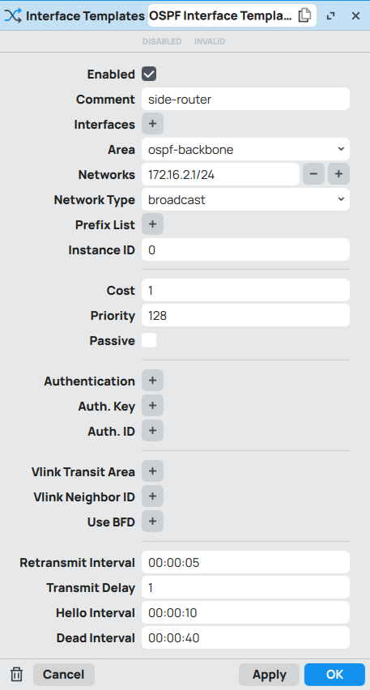

# 基于RouterOS的OSPF功能实现的流量分流科学上网功能
## 致谢
感谢@povsister项目提供的思路和项目代码。方案的原理和请求流程可以仔细阅读大佬写的说明

本仓库的区别在于将OSPF路由添加部分从V2ray中抽离，并将其结合到Mosdns中。这样可以使用AdGurdHome + Mosdns灵活的控制dns的解析、缓存和去广告，另外代理的方案自由选择不需要再依赖于V2ray，本方案中使用的为sing-box作为透明代理服务器。

项目地址：https://github.com/povsister/v2ray-core
## 基本原理（ChatGPT生成）
### 工作原理
#### 1. 动态路由更新
在MOSDNS服务器解析出IP后，会根据域名的规则判断是否将该IP添加到OSPF的路由表中。
如果需要，MOSDNS会动态更新OSPF路由表，将对应的路由条目添加或删除，从而决定流量如何通过特定的网关进行转发。
#### 2. 流量的分流与路由
经过DNS解析后的IP地址会在OSPF路由表中作为路由条目存在。
根据IP路由条目，流量会被导向不同的网关，实现了基于域名的流量分流。
### 关键技术点
#### 1. OSPF协议
OSPF（开放最短路径优先）是一个动态路由协议，能够根据网络的变化自动更新路由表。
在此系统中，OSPF用于根据不同的域名解析结果，自动调整路由路径。
#### 2. MOSDNS服务器
MOSDNS是一个支持规则配置的DNS服务器，能够根据不同的域名返回不同的IP地址。
DNS解析的结果不仅影响客户端的访问路径，还能动态影响路由表的更新。
#### 3. 网关选择与流量转发
根据OSPF路由表的更新，流量被定向到不同的网关。
不同的网关可以根据网络需求进行负载均衡、带宽限制、故障转移等管理。
### 示例场景
#### 正常访问流量：
客户端请求 `www.baidu.com`，MOSDNS服务器返回国内ip不添加路由，正常上网

#### 特定域名流量：
客户端请求 `www.google.com`，MOSDNS服务器解析后国外IP。此时，OSPF路由表被更新，流量通过网关B转发。

#### 负载均衡与容错：
如果网关B出现故障，OSPF中对应路由会删除，从而保证整体网络的可用性。

#### 总结
通过将MOSDNS服务器与RouterOS的OSPF功能结合，可以实现基于域名的流量分流。该方案能够灵活地根据不同的域名选择不同的网关，确保不同类型的流量经过合适的路径，并为网络提供更高的可控性和可靠性。
## 我的网络拓扑

## 配置
### RouterOS
#### OSPF设置
可结合致谢链接中的相关配置进行设置
 1. `Routing -> Tables` 创建新的代理用的路由表，后续需要代理的ip才会走这个路由表，新增路由后需要参考main表在`IP -> Routes`中的配置，为新建的路由表创建路由规则，不然无法上网

 2. `Routing -> OSPF -> Instances` 创建OSPF Instance

 3. `Routing -> OSPF -> Areas` 创建OSPF Area

 4. `Routing -> OSPF -> Interface Templates` 创建OSPF Interface Template

#### 路由策略避免网络回环参考致谢链接中的配置方法
#### 局域网部分ip不走分流
`Routing -> Rules`中新增路由规则，如下图配置了两个规则为`172.16.1.64/26`、`172.16.1.128/26`，意思为IP第4位在64-128、128-192的局域网设备走proxy-table这个表中的路由，不在这个范围内的设备不会被代理

#### 探活设置自行目前还没完善，后续更新
### Mosdns、Sing-box配置
参考仓库对应目录的设置

其中使用的mosdns仓库: https://github.com/SvenShi/mosdns

sing-box服务器中使用的ospf-neighbor:https://github.com/SvenShi/ospf-neighbor
